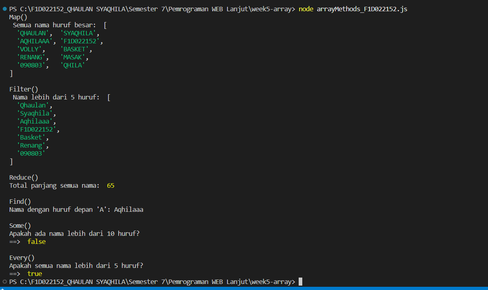

# week5-array

## Identitas
Nama: Qhaulan Syaqhila
NIM: F1D022152

# Deskripsi
1. map() => Mengubah semua elemen array namaTeman menjadi huruf besar agar seragam dan mudah dibaca.
2. filter() => Mengambil hanya nama yang memiliki panjang lebih dari 5 huruf untuk menyaring data berdasarkan kriteria panjang nama.
3. reduce() => Menghitung total panjang seluruh nama dalam array untuk mendapatkan gambaran jumlah karakter secara keseluruhan.
4. find() => Mencari nama pertama yang huruf depannya sama dengan huruf depan nama saya (misalnya "A" untuk Aqhilaaa).
5. some() => Mengecek apakah ada minimal satu nama yang panjangnya lebih dari 10 huruf, untuk mengetahui keberadaan data sesuai kriteria.
6. every() => Mengecek apakah semua nama dalam array memiliki panjang lebih dari 3 huruf, untuk memastikan konsistensi data.

### Kesimpulan 
setiap metode array di JavaScript memiliki fungsi dan kegunaan yang berbeda sesuai kebutuhan pengolahan data. Metode map() digunakan untuk melakukan transformasi pada seluruh elemen array tanpa mengubah data asli, sedangkan filter() berfungsi untuk menyaring elemen berdasarkan kondisi tertentu. Metode reduce() dapat dipakai untuk melakukan perhitungan akumulatif dari semua elemen, sementara find() digunakan untuk mencari elemen pertama yang sesuai dengan kriteria. Selain itu, some() berguna untuk memeriksa apakah ada minimal satu elemen yang memenuhi kondisi, sedangkan every() dipakai untuk mengecek apakah semua elemen dalam array memenuhi kondisi yang sama. Dengan memanfaatkan metode-metode ini, pengolahan data menjadi lebih efisien, mudah dibaca, dan sesuai dengan kebutuhan logika program.

## Hasil Screen Shot
